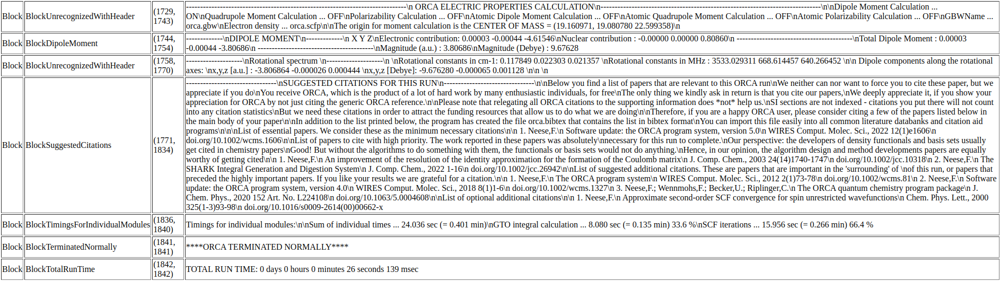

Using ChemParse from the Command Line
=====================================

ChemParse supports command-line usage, allowing for the direct extraction of data from ORCA or GPAW output files into various formats.

Example Commands
----------------

.. code-block:: bash

   orca_to_html example.out example.html

This command extracts data from an ORCA output file and generates an interactive HTML document.

