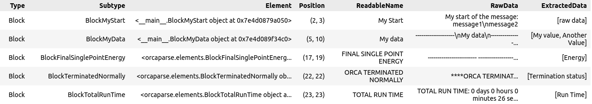

Using ChemParse with Python
===========================

ChemParse can be seamlessly integrated into Python scripts, enabling the extraction and manipulation of data from ORCA output files using familiar tools like pandas.

Example Usage
-------------

.. code-block:: python

   
    import chemparse as chp
    from IPython.display import HTML

     
    # The main class is File

    orca_file = chp.File("example.out")
    display(orca_file)

     
    # You can convert orca output to HTML
    # It is better not to insert ccs and js for jupyter view

    HTML(orca_file.create_html(insert_css=False, insert_js=False))

    # CSS and JS can give way more information
    
    orca_file.save_as_html("example.html", insert_css=True, insert_js=True)
     
    # Let's look at the blocks in the file     
    # Position stands for the begging and final lines of the block. Positions of the spacers are not identified
    
    orca_file.get_blocks()
     
    # Let's extract the raw data. `get_data` returns pandas DataFrame
    
    orca_file.get_data(extract_only_raw=True)
     
    # Let's extract the processed data     

    # You will get warnings about the unrecognized blocks. ExtractedData type is None or orcaparser.data.Data
    
    orca_file.get_data()

     
    # Let's extract the specific block that has "My value" in it

    # The same text may occur in different blocks

    
    orca_file.get_data(raw_data_substring="My value")

     
    # The easiest way to extract the needed data in this case is to add some other text that is present in the block
    
    orca_file.get_data(raw_data_substring=("My value", "My data"))

     
    # Or to exclude the ones that are not yours
    
    orca_file.get_data(raw_data_substring="My value", raw_data_not_substring="Not my match")
     
    # or we can extract the one we need by the readable name (you can find it in html file TOC)
    
    orca_file.get_data(readable_name="My data")
     
    # You can ask for more than one parameter of search
    
    orca_file.get_data(raw_data_substring=("My value", "My data"), readable_name="My data")
     
    # Lets extract the data and have a look on what it contains
    
    df = orca_file.get_data(readable_name="My data")

    data = df.iloc[0].ExtractedData
    print(f"{type(data) = }")
    print(f"{str(data) = }")

    # Even though no method for the extraction was found, the data can be extracted as text

    data["raw data"]

    # Lets extract the data that is known

    # Time is stored as timedelta, tables as pandas Dataframes, values with units as pint Quantity

    df = orca_file.get_data(readable_name="TOTAL RUN TIME")
    data = df.iloc[0].ExtractedData
    print(f"{str(data) = }")
    print(f'{data["Run Time"] = }')

    df = orca_file.get_data(readable_name="FINAL SINGLE POINT ENERGY")
    data = df.iloc[0].ExtractedData
    print(f"{str(data) = }")
    print(f'{data["Energy"] = }')
    print(f'{data["Energy"].magnitude = }')
    print(f'{data["Energy"].units = }')

    

