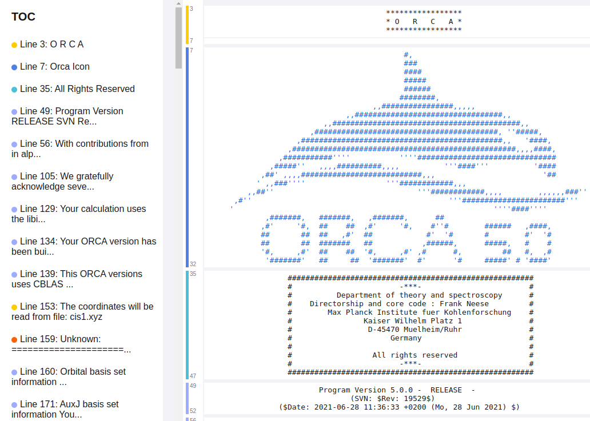

# Summary

ChemParse is a Python-based tool that simplifies the parsing and analysis of computational chemistry toolkit outputs. The software's architecture separates the identification of logical output sections (like geometry optimization steps or frequency calculations) from the extraction of specific numerical values, enabling researchers to define custom extraction patterns with minimal programming overhead. This is particularly important because the formatting of data in output files is often inconsistent between different versions of computational chemistry packages. Furthermore, unexpected warning messages and other inconsistencies within the extracted data can make the extraction process challenging. ChemParse's design caters to researchers who may not have extensive experience with time-efficient coding, providing a user-friendly framework that balances accessibility and computational performance through its two-phase extraction approach.

ChemParse is designed to parse outputs from major computational chemistry packages, including ORCA[@neeseORCAProgramSystem2012; @neeseSoftwareUpdateORCA2018; @neeseSoftwareUpdateORCA2022], GPAW[@enkovaaraElectronicStructureCalculations2010], and VASP [@kresseEfficientIterativeSchemes1996; @kresseEfficiencyAbinitioTotal1996]. While it can be extended to support other formats through custom templates, the current version focuses on providing strong support for ORCA outputs. The tool converts computational results into dynamic HTML documents featuring collapsible sections and configurable visualizations. This approach to output presentation streamlines data analysis and interpretation. Given its open architecture, ChemParse grows through community contributions, allowing researchers to extend and modify the codebase.

# Statement of need

Computational chemistry relies heavily on tools that can extract meaningful insights from the output of quantum chemistry simulations. However, many available tools demand significant technical expertise to customize or extend, creating a barrier for researchers who lack advanced programming skills. These challenges are compounded by the constant evolution of output formats, making adaptability a critical requirement for any parsing solution.

ChemParse addresses these challenges by providing an intuitive interface for defining custom extraction patterns, easing the technical burden on researchers. The tool's architecture handles diverse output formats efficiently, making it particularly valuable for processing large-scale datasets or outputs from multiple quantum chemistry packages.

ChemParse is a data extraction framework designed to support researchers who may not have advanced technical expertise, allowing them to effectively extract and analyze data. This approach differs from tools like cclib[@oboyleCclibLibraryPackageindependent2008], ASE[@larsenAtomicSimulationEnvironment2017; @bahnObjectorientedScriptingInterface2002], and NOMAD[@scheidgenNOMADDistributedWebbased2023], which are geared more toward users with a strong technical background.

# Software description

ChemParse breaks down computational chemistry outputs into discrete data blocks - energies, geometries, dipoles, and similar quantities. Using regular expressions, both built-in and custom, the software identifies these blocks and converts them into structured Python objects for analysis.

The tool simplifies regex pattern creation through "blueprints" - templated guides that help users craft extraction patterns without deep regex knowledge. To optimize performance, especially for large files, data extraction occurs only on demand rather than during initial parsing.

This block-based architecture provides an additional benefit: poorly optimized extraction code only impacts its specific block, not the entire parsing process. By constraining inefficient logic to these small, isolated units, ChemParse maintains robust performance even when users implement suboptimal extraction patterns.

ChemParse also renders parsed data as interactive HTML reports, featuring collapsible navigation and configurable visualizations. The generated output adapts to both exploratory analysis and collaborative review through customizable display templates. This visualization layer integrates with the core parsing framework to create dynamic, browser-based interfaces for computational results.

The current version of the software supports data extraction from ORCA output files (tested with ORCA versions 5 and 6):

- **Energies and SCF[@RevModPhys.23.69] Data**  
  Final single-point energy, total SCF energy, SCF iterations, convergence status, and total runtime.

- **Orbital Data**  
  Orbital energies, occupation numbers.

- **Spectroscopy Data**  
  TD-DFT[@PhysRevLett.52.997] excitations, absorption spectra, and Circular Dichroism[@jp0105138] (CD) spectra.

- **Path and NEB[@asgeirsson2021] Calculations (including NEB-TS and NEB-CI)**  

- **Geometry Optimization Data**

- **Vibrational and Rotational Spectra[@wilson1980molecular] Data**

- **Dipole moments**
  
- **Run Information**  
  Program version, acknowledgments, warnings, input file details, module timings, and success messages.

The tabular data is represented using pandas DataFrames, quantities with units are represented using pint objects.

# Acknowledgements

This work was funded by the Icelandic Research Fund (grant 239970).

# References